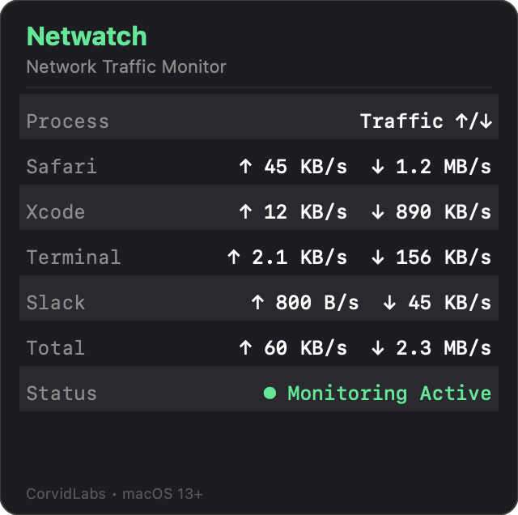

# Netwatch

Network traffic monitor for macOS menu bar. Shows per-process network usage with upload and download speeds.



## Features

- Per-process network traffic monitoring
- Upload and download speed tracking
- Total bandwidth display
- Auto-refreshing every 2 seconds

## Build

```
swift build
```

## Run

```
swift run Netwatch
```
